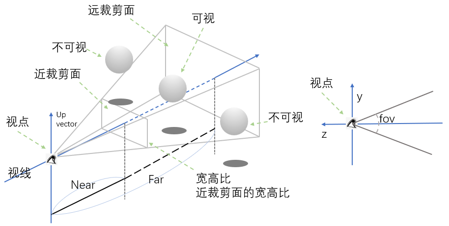

我们常用的相机正交相机(`OrthographicCamera`)和透视相机(`PerspectiveCamera`)两种相机，用于来捕获场景内显示的物体模型。它们有一些通用的属性和方法：

由于相机都是继承至`THREE.Object3D`对象的，所以像设置位置的`position`属性、`rotation`旋转和`scale`缩放属性，可以直接对相机对象设置。我们甚至还可以使用`add()`方法，给相机对象添加子类，移动相机它的子类也会跟随着一块移动，我们可以使用这个特性制作一些比如 HUD 类型的显示界面。

调整相机朝向

```js
camera.target = new THREE.Vector3(0, 0, 0)
camera.lookAt(new THREE.Vector3(0, 0, 0))
```

也可以将相机的朝向改为模型网格的`position`，如果物体的位置发生了变化，相机的焦点方向也会跟随变动

```js
var mesh = new THREE.Mesh(geometry, material)
camera.target = mesh.position
//或者
camera.lookAt(mesh.position)
```

## OrthographicCamera 正交相机

使用正交相机`OrthographicCamera`渲染出来的场景，所有的物体和模型都按照它固有的尺寸和精度显示，一般使用在工业要求精度或者`2D`平面中，因为它能完整的显示物体应有的尺寸。
正交相机显示的范围是一个立方体结构，只要确定`top`，`left`，`right`，`bottom`，`near`和`far`六个值，我们就能确定当前相机捕获场景的区域，在这个区域外面的内容不会被渲染

```js
// left, right, top, bottom, near, far
var orthographicCamera = new THREE.OrthographicCamera(-2, 2, 2, -2, 0, 4)
scene.add(orthographicCamera) //一般不需要将相机放置到场景当中，如果需要添加子元素等一些特殊操作，还是需要add到场景内
```

正常情况相机显示的内容需要和窗口显示的内容同样的比例才能够显示没有被拉伸变形的效果

```js
var frustumSize = 1000 //设置显示相机前方1000高的内容
var aspect = window.innerWidth / window.innerHeight //计算场景的宽高比
var orthographicCamera = new THREE.OrthographicCamera((frustumSize * aspect) / -2, (frustumSize * aspect) / 2, frustumSize / 2, frustumSize / -2, 1, 2000) //根据比例计算出left，top，right，bottom的值
```

也可以动态的修改正交相机的一些属性，注意修改完以后需要调用相机`updateProjectionMatrix()`方法来更新相机显存里面的内容

```js
var frustumSize = 1000 //设置显示相机前方1000高的内容
var aspect = window.innerWidth / window.innerHeight //计算场景的宽高比
var orthographicCamera = new THREE.OrthographicCamera() //实例化一个空的正交相机
orthographicCamera.left = (frustumSize * aspect) / -2 //设置left的值
orthographicCamera.right = (frustumSize * aspect) / 2 //设置right的值
orthographicCamera.top = frustumSize / 2 //设置top的值
orthographicCamera.bottom = frustumSize / -2 //设置bottom的值
orthographicCamera.near = 1 //设置near的值
orthographicCamera.far = 2000 //设置far的值
//注意，最后一定要调用updateProjectionMatrix()方法更新
orthographicCamera.updateProjectionMatrix()
//显示区域尺寸变了，我们也需要修改渲染器的比例
renderer.setSize(window.innerWidth, window.innerHeight)
```

## PerspectiveCamera 透视相机

透视相机是最常用的也是模拟人眼的视角的一种相机，它所渲染生成的页面是一种近大远小的效果

